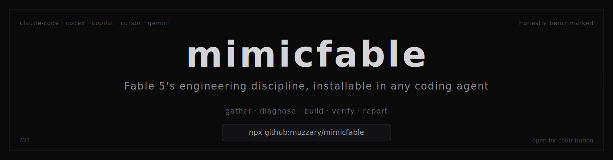

<p align="center">
  
</p>

# mimicfable

Claude Fable 5 works with unusual discipline: it gathers context before acting, commits
to one diagnosis instead of hedging, writes only load-bearing code, and never says
"done" without watching the thing run. mimicfable packages that discipline as an
installable agent and four skills, so other models can work the same way. Built on the
last day of Fable 5 access, benchmarked honestly against plain Opus.

## Install

Needs Node 16+ and git. One command:

```
npx github:muzzary/mimicfable
```

That installs the **fable-engineer** agent and four skills for Claude Code. For other
tools, add a flag:

```
--codex        OpenAI Codex CLI          --gemini       Gemini CLI
--copilot      GitHub Copilot            --agents-md    universal AGENTS.md
--cursor       Cursor                    --uninstall    remove everything
```

Existing config files are never touched: instructions go inside marker comments, and
uninstall removes only those. Verify it yourself with `npm test`.

## What's inside

| | |
|---|---|
| `fable-engineer.md` | Full-lifecycle agent: phased builds, tests per phase, self-review, final gate |
| `skills/` | fable-problem-solving, fable-code-craft, fable-phase-planning, fable-scope-control |
| `PORTABLE.md` | Tool-agnostic version of all of the above |
| `tasks/` + `grade*.py` | The benchmark: 8 task types, hidden graders |
| `results/` | Every delivered solution and verbatim report, so you can check our grading |

## Results, in three sentences

On correctness, the agent and plain Opus **tied 46/46** across 12 runs of planted
tasks. The measured difference is discipline: the agent committed regression test
suites on 4 of 7 tasks (baseline 1 of 7), caught one of its own bugs before commit,
and produced modestly leaner code, at roughly 10 percent more tokens. When a flashy
round-one number failed to replicate, we published the correction.

Full methodology, per-run data, and the disclosed confounds: [BENCHMARK.md](BENCHMARK.md)

## Real-world proof

We ran the agent on a private production website (confidential, so no code, only
outcomes). It traced the site's generic AI-assembled look to a root cause nobody had
spotted, a silently broken CSS token layer with 100+ dangling references, then
implemented the full eight-phase fix plan itself: one commit per phase, live
verification, zero rework requested after the owner's review. Along the way it
corrected an error in its own audit and proved its riskiest change safe from CSS
cascade rules before touching it.

Details: [results/case-study-frontend-audit.md](results/case-study-frontend-audit.md)

## When to use it

**Use it** for code with a future: multi-phase projects, refactors of working code,
anything handling money or user data. The committed tests and verify-before-done
habit are the payoff.

**Skip it** for throwaway scripts and quick fixes. Plain Opus is cheaper, faster, and
just as correct on small tasks. That is what our own benchmark shows.

## Contributing

MIT licensed. The obvious lanes: new benchmark tasks, runs on other models, and
instruction targets for more tools (Windsurf, Aider, Zed). Keep the honesty rule:
findings need evidence, and results that do not replicate get corrected, not buried.
